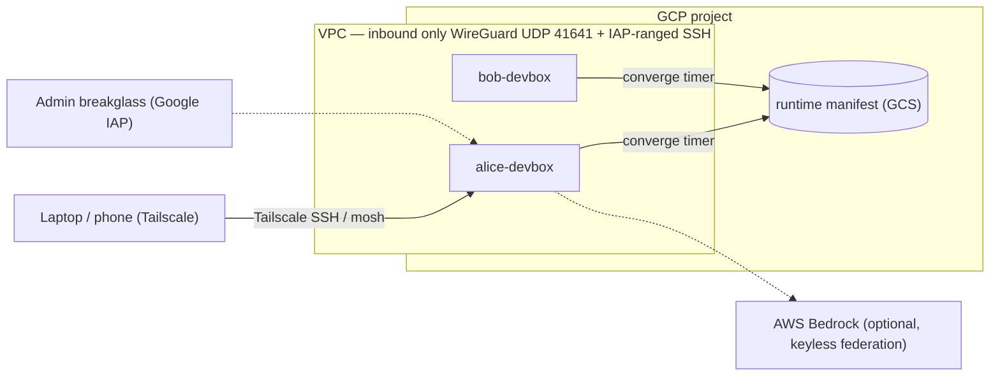

# devbox-fleet

**Always-on cloud devboxes for your team — preinstalled AI coding agents,
reachable from anywhere via Tailscale, no public application ports.**

[](https://github.com/omrihaviv/devbox-fleet/actions/workflows/ci.yml)
[](LICENSE)

One `terraform apply` per developer creates a persistent Ubuntu box they can
reach from a laptop, iPad, or phone — batteries included, safe to rebuild,
centrally updated.



## Why devbox-fleet

- **Fully managed** — devs are entries in a tfvars map; one apply adds a
  box, its disks, snapshots, monitoring, and Tailscale access. Machine
  size, disks, and swap are chosen per machine.
- **Agent-ready out of the box** — Claude Code, Codex CLI, and two Chrome
  DevTools MCP servers preinstalled and wired up at first login.
- **Reachable from anywhere, exposed to almost nothing** — Tailscale SSH
  from laptop or phone; no public application ports or SSH by default.
- **Rebuilds are boring** — home, Docker images, and the box's Tailscale
  identity live on a persistent disk that survives instance replacement —
  which also makes upsizing a machine later a one-line, in-place change.
- **Safe periodic updates** — changes roll out canary → promote and reach
  the fleet within ~9 hours; rolling back means promoting the previous
  manifest. Packages configured as `latest` (gh, Chrome, VS Code) follow
  their vendor repos and are **not promotion-gated**.
- **Optional Amazon Bedrock** — boxes federate their GCP identity into one
  AWS role; no AWS keys on any box.

## What's on every box

Claude Code · Codex CLI · Chrome + DevTools MCP (ephemeral & steerable) ·
Docker + Compose · Node (NVM) · gh · AWS CLI · VS Code for the web · tmux +
resurrect/continuum · mosh · Paseo · earlyoom memory guardrails

## Get started

**Admins** (you're setting up the fleet):
[admin quickstart](docs/admin-quickstart.md) — or let an AI coding agent
walk you through it ([how that works](docs/setup-agent.md)): from a clone
of this repo, paste this into any agent:

```text
Read AGENTS.md, then follow the playbook in docs/setup-agent.md to set up
devbox-fleet for my organization. Interview me for the values you need, show
me every cloud change and get my OK before applying it, and never ask me to
paste secrets into chat.
```

**Developers** (you just got a box):
[dev quickstart](docs/dev-quickstart.md).

## How it works

Terraform (`gcp/`) provisions the fleet. Each box re-applies a centrally
promoted runtime configuration on a timer, so toolchain changes never need
rebuilds: `terraform apply` uploads a candidate, you verify it on one canary
box, and `promote-runtime.sh` releases it to everyone. Developer onboarding
runs at first SSH login — GitHub auth, Claude Code auth, MCP servers, and
cloning your org's repo list.

## Security model

- SSH only over Tailscale; port 22 is open only to Google's IAP range for
  audited admin breakglass. Each box exposes one public port: UDP 41641 for
  WireGuard itself.
- **Heads up:** once enabled, this repo becomes the **sole writer of your
  tailnet's ACL** and replaces the whole policy on every apply — use a
  dedicated tailnet, or merge your policy first
  ([details](docs/admin-runbook.md)).
- Admins can reach every box on every port (incident response — and
  tightenable). Devs can deliberately share a port publicly via Tailscale
  Funnel.
- No long-lived AWS or admin cloud keys on boxes; developer tokens and
  browser sessions live on the dev's own persistent disk. Full baseline:
  [admin runbook](docs/admin-runbook.md).

## Docs

[Admin quickstart](docs/admin-quickstart.md) ·
[Admin runbook](docs/admin-runbook.md) (authoritative) ·
[Dev quickstart](docs/dev-quickstart.md) ·
[Agent setup](docs/setup-agent.md) · [FAQ](docs/faq.md)

## Development

`bash tests/<name>.sh` — static suite, no cloud needed (Bash, Git, GNU
coreutils, `rg`, `jq`, Python 3.11+). CI runs it plus
`terraform fmt/validate/test`. See [CONTRIBUTING.md](CONTRIBUTING.md).

## License

MIT — see [LICENSE](LICENSE).
