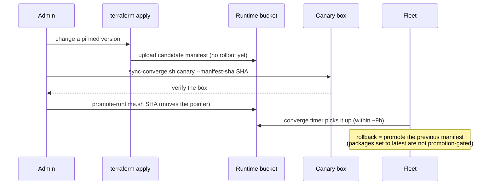

# Admin quickstart — zero to first devbox

Condensed from the [admin runbook](admin-runbook.md); where they differ, the
runbook wins. Prefer an AI agent walking you through this? See
[setup-agent.md](setup-agent.md).

**What you're building:** one GCP project holding a per-developer fleet of
always-on devboxes, reached over Tailscale (no public application ports or
SSH by default), updated via a canary → promote flow.

## 0. Prerequisites

- A GCP organization + billing account you can create projects in.
- A Tailscale account — **a tailnet dedicated to devboxes is strongly
  recommended**: once enabled, this repo becomes the sole writer of the
  tailnet's ACL and replaces the whole policy on every apply
  ([why](admin-runbook.md#one-time-tailscale-setup)). Existing tailnet? Merge
  your policy into `gcp/tailscale-acl.tf` first.
- Locally: `terraform` (>= 1.9), `gcloud`, `jq`, `git`. Check everything at
  any time with `scripts/preflight`.

## 1. One-time Tailscale setup

- **Create a tailnet** at https://login.tailscale.com/, invite your admin
  email, and accept the invite.
- **Seed the delegating tag** before creating the OAuth client: in the
  Tailscale admin panel's Access controls editor, merge
  `tag:devbox-key-minter` into `tagOwners` (owner `autogroup:admin`) and
  save. Terraform replaces this seed with the full reviewed policy once you
  open the gate in step 5.
- **Create one OAuth client** (Admin panel → Trust credentials → Credential
  → OAuth) with BOTH scopes: `auth_keys` (write, tag-restricted to
  `tag:devbox-key-minter`) and `policy_file` (write). Keep the client id and
  secret in your admin credential store for now — you paste them into
  `gcp/terraform.tfvars` in step 3, **after** its `cp` creates the file —
  and **treat this credential like an admin credential.**

Full rationale for the tag pattern and step order: [runbook, One-time Tailscale setup](admin-runbook.md#one-time-tailscale-setup).

## 2. One-time GCP bootstrap

Run once, before the first apply. Substitute your own project id, org id,
billing account, and region for the placeholders below. Note gcloud keeps
two separate credentials — the CLI login (first line, used by every `gcloud`
command) and Application Default Credentials (last line, used by Terraform);
a fresh machine needs both:

```bash
gcloud auth list    # CLI credential — skip the next line if your admin account is already active
gcloud auth login
gcloud projects create your-project-id --organization=<ORG_ID>
gcloud billing projects link your-project-id --billing-account=<BILLING_ACCOUNT>
gcloud services enable compute.googleapis.com iam.googleapis.com iap.googleapis.com \
  storage.googleapis.com monitoring.googleapis.com logging.googleapis.com \
  cloudresourcemanager.googleapis.com \
  --project=your-project-id
# Terraform state bucket — versioned, uniform access.
gcloud storage buckets create gs://your-tfstate-bucket --project=your-project-id \
  --location=us-central1 --uniform-bucket-level-access
gcloud storage buckets update gs://your-tfstate-bucket --versioning
# Admin group: owner via bootstrap (NOT Terraform — see gcp/iam.tf comment).
gcloud projects add-iam-policy-binding your-project-id \
  --member="group:devbox-admins@example.com" --role="roles/owner"
gcloud auth application-default login   # Terraform ADC
```

Full rationale: [runbook, One-time GCP bootstrap](admin-runbook.md#one-time-gcp-bootstrap).

## 3. Configure

```bash
cp gcp/backend.hcl.example gcp/backend.hcl
cp gcp/terraform.tfvars.example gcp/terraform.tfvars
cp scripts/devbox-repos.example scripts/devbox-repos.default
```

Fill in your org values — the bucket name from step 2 in `backend.hcl`, and
in `terraform.tfvars` the OAuth client id/secret and tailnet you kept aside
in step 1, plus the rest of the example's fields. Keep the gate closed — `manage_tailscale_acl = false` and
`devs = {}` — until step 5. Write the repo list now, **before the first
apply**: a dev who onboards before it exists gets an empty
`~/.devbox-repos` that is never re-seeded. Then run `scripts/preflight`.

Rationale: repo-list timing is under [runbook, One-time GCP bootstrap](admin-runbook.md#one-time-gcp-bootstrap); the gate-closed fields are explained under [runbook, First apply](admin-runbook.md#first-apply).

## 4. Plumbing apply + first promotion

```bash
terraform -chdir=gcp init -backend-config=backend.hcl
terraform -chdir=gcp apply
```

Verify the plan has **no `tailscale_acl` resource and no
`google_compute_instance`** — plumbing only (bucket, IAM, network,
monitoring, runtime candidate upload). Then promote the initial runtime —
risk-free, since no boxes exist yet:

```bash
DEVBOX_RUNTIME_BUCKET=$(terraform -chdir=gcp output -raw runtime_bucket) \
  scripts/gcp/promote-runtime.sh $(terraform -chdir=gcp output -raw runtime_manifest_sha256)
```

Full detail: [runbook, First apply](admin-runbook.md#first-apply).

## 5. Preview the ACL, then open the gate with your first machine

While the gate is still closed, inspect the ACL **skeleton** Terraform has
rendered so far — admin group, tag owner, admin-self rule, node attributes,
and no per-machine rules yet:

```bash
terraform -chdir=gcp output -raw devbox_acl_json | jq .
```

Now open the gate: in `gcp/terraform.tfvars`, set `manage_tailscale_acl =
true` and add your own first machine to `devs`. Create a fresh saved plan
outside the repo, extract the planned ACL, and inspect every group, owner,
packet rule, SSH rule, node attribute, and test **before** applying:

```bash
set -euo pipefail
first_plan_dir="$(mktemp -d)"
first_plan="$first_plan_dir/first-machine.tfplan"
terraform -chdir=gcp plan -out="$first_plan"
terraform -chdir=gcp show -json "$first_plan" \
  | jq -er '.planned_values.outputs.devbox_acl_json.value | select(type == "string" and length > 0)' \
  | jq -e .
# STOP if this is not the complete policy you intend to own.
```

**Stop and read the JSON you just printed** — it is the complete policy this
root will own. Applying a saved plan does not ask for confirmation, so run
the next block only when that document is exactly what you intend:

```bash
terraform -chdir=gcp apply "$first_plan"
rm -f -- "$first_plan" && rmdir -- "$first_plan_dir"
```

If you decide not to apply, still delete the saved plan — it contains
evaluated sensitive variables:

```bash
rm -f -- "$first_plan" && rmdir -- "$first_plan_dir"
```

**From this apply onward the root is the sole ACL writer — never flip the
gate back.**

Full detail: [runbook, First apply](admin-runbook.md#first-apply).

## 6. Canary checklist (abridged)

On the new box (`<name>` is the machine key):

- [ ] **Tailscale SSH:** `ssh dev@<name>-devbox true` connects.
- [ ] **Data disk mounted:** `ssh dev@<name>-devbox 'mount | grep /data'` shows `/dev/disk/by-id/google-data` on `/data`.
- [ ] **Converge timer armed:** `ssh dev@<name>-devbox 'systemctl list-timers devbox-converge.timer'` shows a next run within ~9h.
- [ ] **Converge succeeded, AND the metric incremented (don't skip this half):** the `devbox-converge-success` log line appears in Cloud Logging, and the matching log-based metric actually incremented in Metrics Explorer.
- [ ] **IAP breakglass round-trip:** `gcloud compute ssh <name>-devbox --tunnel-through-iap --zone=<zone>` lands you on the box.

Full checklist (dashboard, snapshot policy, the generation-bump rebuild check, and the post-federation checks): [runbook, First apply](admin-runbook.md#first-apply).

## How updates roll out



Full walkthrough: [runbook, Routine operations](admin-runbook.md#routine-operations).

Add a dev later: append to `devs`, `terraform -chdir=gcp apply`, tell them
`ssh dev@<key>-devbox`. Everything else (Bedrock federation, resizing,
rebuilds, offboarding, breakglass): [admin runbook](admin-runbook.md).
